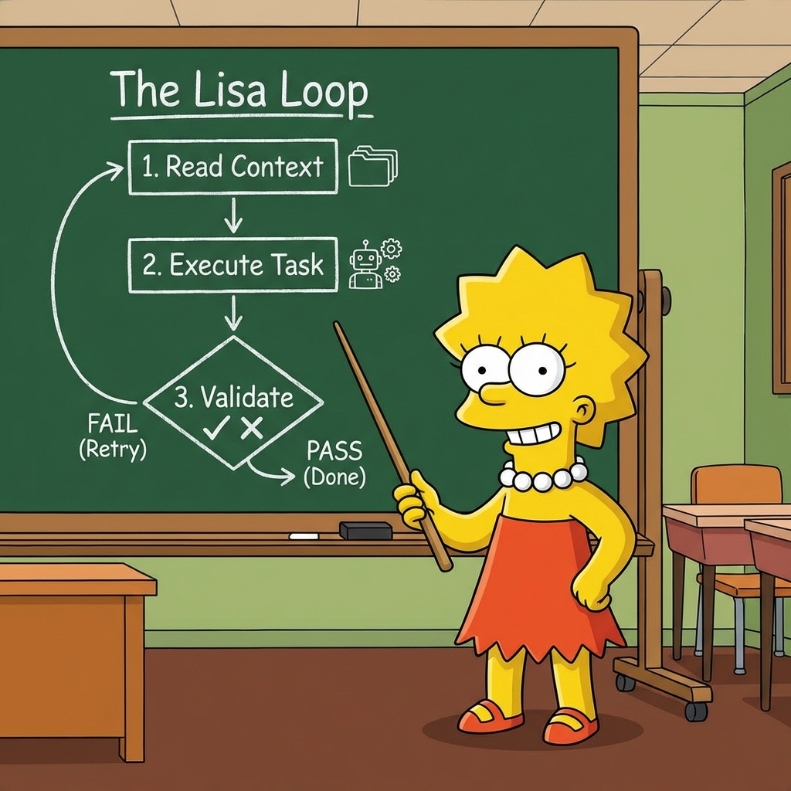

# Lisa - Gemini Autonomous Agent Plugin

Implementation of the **Ralph Wiggum technique** for iterative, self-referential AI development loops, adapted for the **Gemini CLI**.

> "I'm a unit test!" — Lisa



## What is Lisa?

Lisa is a faithful port of **Ralph** (for Claude Code) to the Gemini ecosystem. It is a development methodology based on continuous AI agent loops.

As with Ralph, Lisa is essentially a **smart loop**: a process that repeatedly feeds the AI agent a project context and a task list (`prd.json`), allowing it to iteratively improve its work until validation passes.

### Core Concept

Lisa works by wrapping the Gemini CLI in a persistent feedback loop:

1.  **Read Context:** Lisa scans your project files (ignoring git/artifacts).
2.  **Read Task:** Lisa looks at `prd.json` for the next "failing" User Story.
3.  **Execute:** Lisa prompts Gemini to solve the task.
4.  **Validate:** Lisa runs `hooks/validate.sh`.
    *   **If Pass:** The story is marked `true` in `prd.json`.
    *   **If Fail:** The `hooks/stop-hook.sh` runs, and Lisa **retries** the loop with the same context.

This creates a self-healing mechanism where the agent is forced to fix its own mistakes before moving on.

## Quick Start

### Prerequisites
*   **Gemini CLI** installed and authenticated.
*   `jq` installed (for JSON parsing).

### Usage

1.  **Define your work** in `prd.json`.
2.  **Start the loop:**

```bash
./lisa lisa-loop
```

Lisa will now work autonomously until all stories in `prd.json` are marked as `passes: true`.

## Commands

### `./lisa lisa-loop [max_iterations]`
Starts the autonomous development loop.
*   **max_iterations**: Optional. Defaults to 20. Safety limit to prevent infinite loops.

**Example:**
```bash
./lisa lisa-loop 50
```

## File Structure (Ralph-Compatible)

Lisa mimics the [Claude Code Plugin](https://docs.anthropic.com/en/docs/agents-and-tools/claude-code/plugins) structure:

```
.
├── lisa                   # Plugin Loader (Entry Point)
├── prd.json               # The "Brain" - Task tracking
├── commands/
│   └── lisa-loop.sh       # The Core Loop Logic
├── hooks/
│   ├── validate.sh        # QUALITY GATE: Must pass for task completion
│   └── stop-hook.sh       # SAFETY NET: Runs on failure
└── .gemini-plugin/
    └── plugin.json        # Plugin Metadata
```

## Lisa vs. Ralph (The Differences)

While functionality is identical, the implementation differs to suit the Gemini ecosystem:

| Feature | Ralph (Claude Code) | Lisa (Gemini CLI) |
| :--- | :--- | :--- |
| **Engine** | Claude Code Plugin API | Gemini CLI Wrapper |
| **State** | Implicit (Session History) | Explicit (`prd.json` status) |
| **Completion** | String Match (`<promise>DONE</promise>`) | **Validation Script** (`hooks/validate.sh`) |
| **Context** | Differential (Git) | **Full Context** (Smart File Dump) |

## Philosophy

1.  **Iteration > Perfection:** Lisa expects to fail. The loop is designed to catch failures and retry.
2.  **Failures Are Data:** When `hooks/validate.sh` fails, that failure becomes context for the next run.
3.  **Persistence:** Lisa doesn't quit until the tests pass (or she hits `max_iterations`).

## Hooks System

*   **`hooks/validate.sh`**: You **MUST** implement this for your project.
    *   Return `0` if the code is correct (e.g., `npm test`, `pytest`).
    *   Return `1` if the code is broken.
    *   *Default included script just checks for basic syntax errors.*
*   **`hooks/stop-hook.sh`**: Called when things go wrong. Use this to log errors, send notifications, or revert bad git commits.

---

*Based on the original [Ralph Wiggum Plugin](https://github.com/anthropics/claude-code/tree/main/plugins/ralph-wiggum) by Anthropic.*